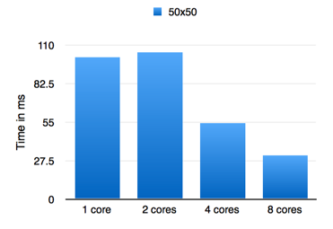
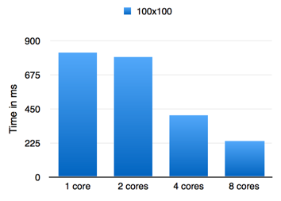
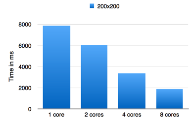
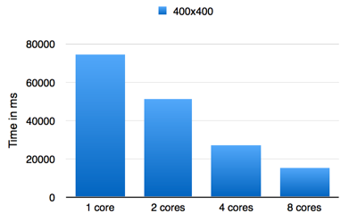

# ExMatrix


[](https://travis-ci.org/a115/exmatrix) [](https://hex.pm/packages/exmatrix)


ExMatrix is an Elixir library implementing a parallel matrix multiplication algorithm with other utilities for working with matrices.

### Installation

The latest version is `0.0.1` and requires Elixir `~> 1.0`.

Releases are published through [hex.pm](https://hex.pm/packages/exmatrix). Add as a dependency in your `mix.exs` file:

```elixir
defp deps do
  [ { :exmatrix, "~> 0.0.1" } ]
end
```

### Matrices

Matrices are expected to be lists of lists of numbers, so for example, a simple 2x2 matrix might look like

```elixir
iex> matrix = [[0, 0], [1,1]]
[[0, 0], [1,1]]
```

To get an empty matrix you can use ```new_matrix``` to generate a zero-filled matrix

```elixir
iex> ExMatrix.new_matrix(2,2)
[[0, 0], [0,0]]
```

To test out the library, you can generate a random matrix using ```random_cells``` by passing the number of rows, columns and a maximum value to be contained in each cell.

```elixir
iex> random_cells(2, 2, 10)
[[3, 4], [9, 0]]
```


### Multiplication

To multiply two matrices together you can call either ```multiply``` or ```pmultiply``` if you wish to do the multiplication in parallel.

```elixir
iex> matrix_a = [[2,3], [3,5]]
[[2,3], [3,5]]
iex> matrix_b = [[1,2], [5,-1]]
[[1,2], [5,-1]]
iex> ExMatrix.multiply(matrix_a, matrix_b)
[[17, 1], [28, 1]]
```

### Addition

Addition of matrices happens as you might expect, with the ```add``` function

```elixir
iex> matrix_a = [[0, 1, 2], [9, 8, 7]]
[[0, 1, 2], [9, 8, 7]]
iex> matrix_b = [[6, 5, 4], [3, 4, 5]]
[[6, 5, 4], [3, 4, 5]]
iex> ExMatrix.add(matrix_a, matrix_b)
[[6, 6, 6], [12, 12, 12]]
```
If you provide two matrices where the number of rows or columns differs, then an ```ArgumentError``` is raised.


### Subtraction

Subtraction is performed on two matrices (which must have the same dimentions) by using the ```subtract``` function

```elixir
iex> matrix_a = [[0, 1, 2], [9, 8, 7]]
[[0, 1, 2], [9, 8, 7]]
iex> from_matrix = [[6, 5, 4], [3, 4, 5]]
[[6, 5, 4], [3, 4, 5]]
iex> ExMatrix.subtract(matrix_a, from_matrix)
[[-6, -4, -2], [6, 4, 2]]
```


If you provide two matrices where the number of rows or columns differs, then an ```ArgumentError``` is raised.


### Utility functions

#### Size

The ```size``` function will return the number of rows and columns in your matrix.

```elixir
iex> {rows, cols} = ExMatrix.size([[1,2,3], [4, 5, 6], [7, 8, 9]])
{3, 3}
iex> rows
3
```

#### Transpose

You can transpose a matrix so that the columns become rows (rotating the matrix by 90 degrees).

```elixir
iex> ExMatrix.transpose([[1,2,3], [4, 5, 6], [7, 8, 9]])
[[1, 4, 7], [2, 5, 8], [3, 6, 9]]
```


## Benchmarks

The initial aim of ExMatrix was to benchmark how well it performed when scaled across a differing number of CPU cores.  Rather than measure the number-crunching ability of Elixir, the benchmarks included measure how well it performs when large matrices are multiplied on 1, 2, 4 and 8 cores.  

You can run the benchmarks yourself using the mix bench command.


```elixir
MIX_ENV=prod mix bench
```

To try the benchmark with differing numbers of cores, depends on your operating system.  

* OSX - Use Instruments.app where in the Preferences pane you can change the number of active cores.
* Linux - This [page on stackexchange](http://unix.stackexchange.com/questions/145645/diabling-cpu-cores-on-quad-core-processor-on-linux) describes how to turn off individual cores on linux.
* Windows - You can turn off individual cores using the steps described [here]
(http://en.kioskea.net/faq/616-multicore-cpu-how-to-disable-a-core#procedure-when-using-windows-vista-7-and-xp) 


### OSX - 8 cores, 16Gb RAM

The following results show the outcome of running the benchmarks on the author's machine (OSX, 8cores, 16Gb) using 1, 2, 4 and 8 cores.  The matrix sizes used were 50x50, 100x100, 200x200, 400x400.  There is a threshold (to be determined) below which the size of the computation on the matrix is  apparently outweighed by the time taken to spawn and wait for the processes.  The charts below show for the 50x50 and 100x100 matrices no better performance between 1 and 2 cores, and it maybe that the threshold is around this point.

#### Total times

The table below shows the times (in ms) as reported by [benchfella](https://github.com/alco/benchfella).  

|   | 50x50  |  100x100 | 200x200  | 400x400   |
|---|---|---|---|---|
| **1 core**   |  101  | 817   |  7881   |  74524  |
| **2 cores**  | 105  |  795  |  6028  |  51493  |
| **4 cores**  |  54  | 404  | 3340  | 27339   |
| **8 cores**   | 31  |  240  |  1858 |  15179 |


#### 50x50 Matrix



#### 100x100 Matrix



#### 200x200



#### 400x400




### License

```
   Copyright 2015 A115 Ltd

   Licensed under the Apache License, Version 2.0 (the "License");
   you may not use this file except in compliance with the License.
   You may obtain a copy of the License at

       http://www.apache.org/licenses/LICENSE-2.0

   Unless required by applicable law or agreed to in writing, software
   distributed under the License is distributed on an "AS IS" BASIS,
   WITHOUT WARRANTIES OR CONDITIONS OF ANY KIND, either express or implied.
   See the License for the specific language governing permissions and
   limitations under the License.
```
